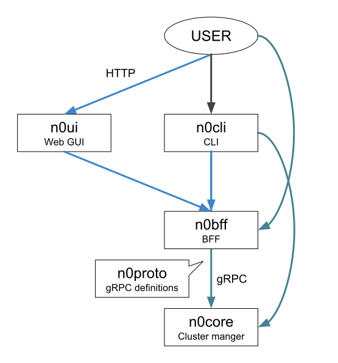

# n0stack

Builds: 

<!--  -->

Documentations: 

License: 

The n0stack is a simple cloud provider using gRPC.

## Description

The n0stack is...

- a cloud provider.
    - You can use some features: booting VMs, managing networks and so on (see also [n0proto](n0proto/).)
- simple.
    - There are shortcode and fewer options.
- using gRPC.
    - A unified interface increase reusability.
- able to be used as library and framework.
    - You can concentrate to develop your logic by sharing libraries and frameworks for middleware, test, and deployment.

## Motivation

Cloud providers have various forms depending on users.
This problem has been solved with many options and add-ons (e.g. OpenStack configuration file is very long.)
However, it is difficult to adapt to the application by options, then it is necessary to read or rewrite long abstracted codes.
Therefore, I thought that it would be better to code on your hands from beginning.

There are some problems to develop cloud providers from scratch: no library, software quality, man-hour, and deployment.
The n0stack wants to solve such problems.

<!-- ## Demo -->

## Components

### [n0proto](n0proto/)

Protobuf definitions for all of n0stack services.

### [n0cli](n0cli/)

CLI for n0stack API.

<!-- ### n0ui

Web UI for n0stack API -->

### [n0core](n0core/)

The example for implementations about n0stack API.
