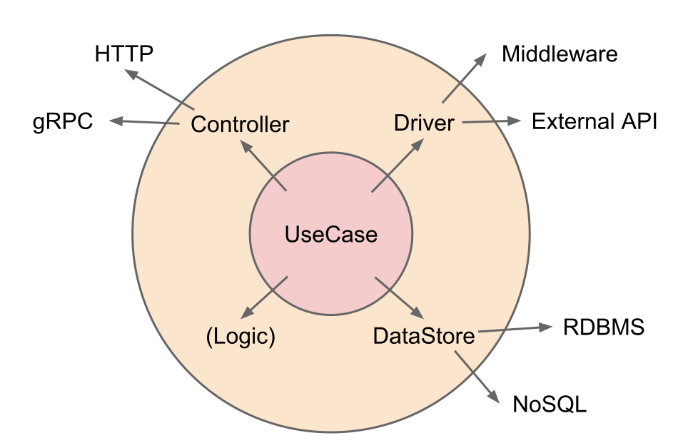

# Software architecture

ソフトウェア開発において、ソフトウェアアーキテクチャは開発中の効率やテストコードの下記やすさに直結する非常に重要な要素である。 

## 背景

### 依存と凝集

### 既存のアーキテクチャ: Layered Architecture
### 既存のアーキテクチャ: Hexagonal Architecture

Layered Architecture が1次元的なものであったのに対し、2次元に展開したのが Hexagonal Architecture である

### 既存のアーキテクチャ: Onion Architecture

一般的に企業で作るアプリケーションの場合はビジネスロジックが変更されにくく、パフォーマンスなどの改善のため外部アプリケーションを変更したいという思想のため、 Onion Architecture ではビジネスロジックを一番内側の層においている。しかし、デメリットとして外側の層のすべてを抽象化する必要があるため、コードが肥大がしやすいというものがある。例えばデータベースを変更する場合、データベースを変更したことでビジネスロジックのコードが変更されることがあってはならない。ビジネスロジック側のコードで定義したインターフェイスでデータベースのコードを書くことになり、これを一般的に依存性の注入と呼ぶ。データベースに接続するライブラリとビジネスロジック側で定義したインターフェイスを接続するためにアダプターと呼ばれる中間層を作ることが多い。よって、層が増えるにつれて中間層を書く必要性も増え、本質ではないコードを多く書く必要がある。 DDD が苦行と呼ばれるのは動くかわからないようなコード量の時代から、このような本質ではにコードを書き続ける必要があるからであると考えている。

### 既存のアーキテクチャ: Clean Architecture

## 提案

既存のアーキテクチャを参考に図のようなアーキテクチャを提案する。 Hexagonal Architecture の一種であり、外側のレイヤーは他の外側のレイヤーに原則依存してはならない。各要素は以下のような役割を持っている。

- UseCase: API の実装を行う。
- Controller: API の定義を行う。gRPC、Swagger、HTMLテンプレートなどが挙げられる。
- Driver: 外部の API や QEMU などに対するアダプタの役割を担う。
- DataStore: データベースなどデータの永続化を行う。
- Logic: ビジネスロジックやアルゴリズムなど UseCase から切り出せるものを切り出す。 Logic のみをパッケージとして切り出すことを強制せず、 Driver や DataStore に含めることを許容する。

外部のものをラップするようなライブラリは近年の OSS の流行により

OSS においてユースケースを決定する作業は重要であるが、万人にとって共通のユースケースを探す作業は一般的に難しい。そこで n0stack では共通のユースケースを探すことをやめることにし、使いたい人が各自必要なユースケースを書けばよいとすることにした。そのため、 UseCase は変更の頻度が高く、一番ライフサイクルの短いものとなったため安定依存の原則より一番内側の層とした。

usecaseを中心に外部に依存するのが正しいアーキテクチャだと思うんだよな
ライブラリはOSSが多いから安定するはずだし、そもそもライブラリなんだから本来安定しているはず
ビジネスロジックが安定するのは、ロジックだけなんだからそれはそうって感じ
じゃあそれらを組み合わせるAPIでいうエンドポイントとなるユースケースはどうなのかというと、それが一番安定しないというか変更頻度が高いのは自明
だからユースケースを中心に外部に依存していくのが正しいと思う

### MVC に適用

Django の MVC を例に考える。

## n0core の実践

## まとめ

n0coreを開発するに当たって "オープン・クローズドの原則" のように拡張に開いたアーキテクチャではなく、変更に開いたアーキテクチャを考えることで新しい技術を導入しやすく、抽象化の量がへるのでコードの量を大幅に減らした簡素な実装を行うことができた。また、 UseCase はソフトウェア工学としては抽象度の低い実装となるが、機能を外側のレイヤに切り出しているためコードを意味的に書くことができた。今後の課題として、 n0ui など Web API 以外の開発にも適用できるか試してみたい。

## References
