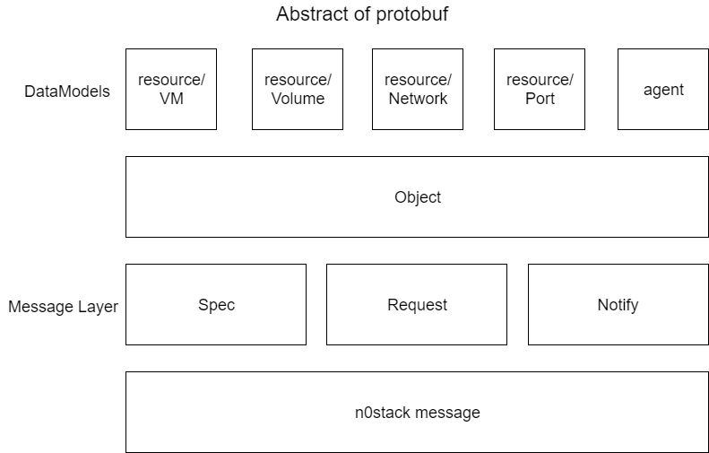

# Messages

**If you want to get latest informations, please see `/proto`.**

メッセージのやり取りにはprotobufを用いる。



## Object layer

See details below.

- [Resources](../data_structure/resources.md)
- [Agents](../data_structure/agents.md)

## Abstract object layer

See details below.

- [Objects](../data_structure/objects.md)

`state` にはenumフィールドとして定義されている必要がある。しかし、protobufの制約上実際には各オブジェクトで `state` を定義する。

```yaml
id: cdbd0107-8ee7-48b1-bfac-f671941c4948
type:
dependencies:
  - object:
    property:
```

## Message layer

以下の3種類のメッセージでオブジェクトを各プロセスに周知する。

|field number|Spec|Request|Notify|
|--|--|--|--|
|1|string spec_id|string spec_id|string spec_id|
|2|Object object|Object object|Object object|
|3|repeated Annotation annotations||Events event|
|4|||bool succeeded|
|5|||string message|
|6|

### Spec

- -> Schedulerに用いる
- 複数のObjectを伝えることができる
- idにはspecのIDを入力する
  - [データベース](../data_structure/rdbms.md) でAPIが発行してもらったものを入力する

```yaml
id:
annotations:
  hoge: hoge
spec:
  - object
```

### Request

- -> agentに用いる
- 単一のObjectを伝える
- agentにresourceを展開させる

```yaml
spec_id:
object:
depended_by:
  - resource/vm/kvm/ihsadiufs
```

#### Notify

- -> Conductorに用いる
- 単一のObjectを伝える
- agentの操作の結果を伝える

```yaml
spec_id:
object:
msg: hogehoge
event: APPLIED
succeeded: true
```

##### event

- SCHEDULED
- APPLIED

## Versioning layer

```yaml
version:
```
