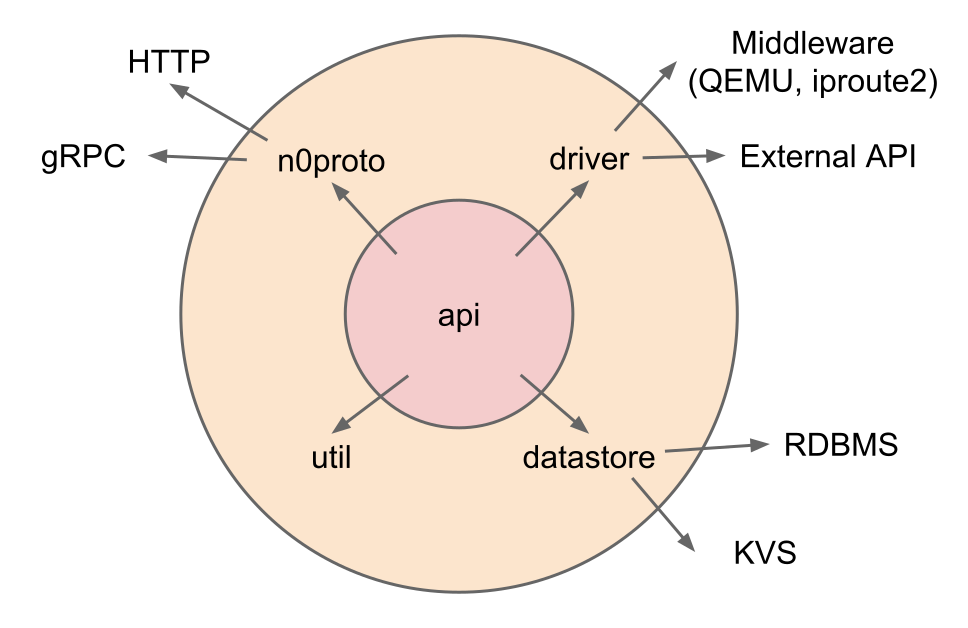

# n0core packages

|||
|--|--|
| Status | accepted |

## Context

- 上位レイヤのパッケージの依存関係を明確にすることで、開発を効率的に行うことができると考えている

## Decision

以下のように区分する。

### n0core/pkg/api

- API の実装を書く

### n0core/pkg/datastore

- データの永続化、ロック

### n0core/pkg/driver

- 外部依存や副作用があるようなモジュール

### n0core/pkg/util

- 外部依存や副作用がなくてみんなで共通で使えるモジュール

### n0core/pkg/deploy

- バイナリをデプロイするなどの処理を書く

### n0proto.go/*

- n0protoでgRPC定義されたものを、 `make build-n0proto` で自動生成されたもの

### n0proto.go/pkg/transaction

- 処理のトランザクションを管理するモジュール
- TODO: n0core/pkg/util に移す

## Consequences

- 適宜更新
