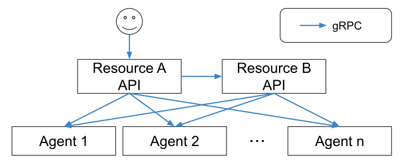

# Synchronous RPC System Architecture

|||
|--|--|
| Status | accepted |

## Context

[Asynchronous Messaging Queue System Architecture](asynchronous_mq_system_architecture.md) の反省点としては、MQのような難しすぎる概念を導入しても手に負えず、構築を簡単にするには構成を簡単にする必要があることを学んだ。

また、Kubernetesはコンテナ管理基盤としてCRDインターフェイスを採用し、ステートレスなりソースの管理に長けている。
しかし、CRDではVirtual Machineの起動、再起動、シャットダウンなどを表現することは難しく、ステートフルなリソースを管理するためにはRPCインターフェイスが必要であると考えた。

## Decision

- シンプルな構成にするため、同期的に処理を伝播していく
    - APIでユーザーからのリクエストを受理し、APIが各ノードのAgentに指示をだす
    - [Designing Distributed Systems](https://azure.microsoft.com/en-us/resources/designing-distributed-systems/en-us/) でいうScatter/Gatherパターンであり、ミドルウェアは永続化を行うデータベースだけとなる
- gRPCインターフェイスを作る

### [Transaction](transaction.md)

同期的に実行するため、一つのエンドポイントで多くの処理を行い、失敗する可能性も高い。
よって、原子性 (Atomicity) を保証するために操作をロールバックする仕組みを実装した。

### [Resource Operation Lock System](lock.md)

リソース操作の独立性 (Isolation) を保証するために操作を開始するときにロックする仕組みを実装した。

### [Pending State](pending.md)

操作が障害などによって中断されるなど、リソースがRPCの操作からではどうしようもなくなったことを示す状態を定義した。

## Consequences

ICTSC 2018で600台近くのVirtual Machineを管理した。詳細は [こちら](https://www.slideshare.net/h-otter/n0stack-in-ictsc-2018) 。

### Pros

- RPCに成功したか、失敗したか、PENDINGステートのゴミが出来上がるかの三択
- リソースの作成は理論上一番はやい構成
- 構成要素が少なく、構築が簡単

### Cons

- CopyBlockImageなど遅いエンドポイントで待たされる
- 遅いエンドポイントではセッションが切れたりユーザーが中断することでPENDINGステートのものが生成される可能性が高い
- エンドポイントごとに処理時間の差が大きいため、APIプロセスの負荷が偏る可能性が高い

## Reference

- https://www.slideshare.net/h-otter/n0stack-in-ictsc-2018
- https://www.slideshare.net/h-otter/n0stack-122135453
