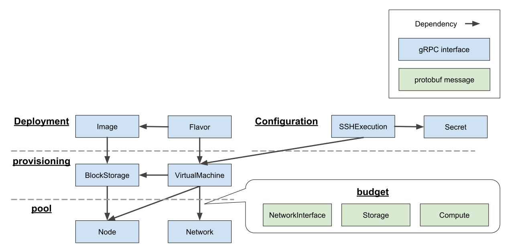

# Overview about n0proto

The n0proto is gRPC definitions for all of n0stack API.

## Resource groups

### Budget

Budget define data structure about resource budget: CPU, Memory, IP address, MAC address, storage, and so on.

Budget はリソースを表すデータ構造である。CPUやメモリなどが含まれる。

### Pool

Pool ensure Budgets.

Pool は Budget を払い出す。

#### Node

- 物理的なサーバ
- CPU、メモリ、ストレージを払い出す

#### Network

- 仮想的なネットワーク
- IPアドレスやMACアドレスを払い出す

### Provisioning

Provisioning create virtual resources on ensured budget.

Poolから予約されたリソースで仮想的なリソースを作り出す。

#### BlockStorage

- NodeのStorageから仮想的なブロックストレージを作り出す
- 中身はQcow2ファイル

#### VirtualMachine

- NodeのCompute(CPUとメモリ)からVMを作り出す
- この時BlockStorageと、Networkに接続するNetworkInterface(MACアドレスとIPアドレス)を接続することができる

### Deployment

Deployment abstract Provisioning operations.

DeploymentはProvisioningを抽象的にすることでわかりやすくするものである。

#### Image

- BlockStorageを抽象化する
- Imageに登録されたBlockStorageからBlockStorageを生成することができる
- 一般にはImageでBlockStorageを生成し、生成したBlockStorageからVMを起動することでOpenstackのGlanceのような使い方ができる ([detail](usecases/boot_vm_with_image.md))

<!-- ### [Configuration](configuration/)

Configuration setting up Provisioning. -->

## Naming Conventions about API

### Standard fields

#### name

- Unique key

#### annotations

- Field that stores implementation-dependent values

#### [Resource type]_name

- Reference to resources

#### *s

- List field

### Standard methods

#### List
#### Get
#### Create / Apply
#### Update
#### Delete
