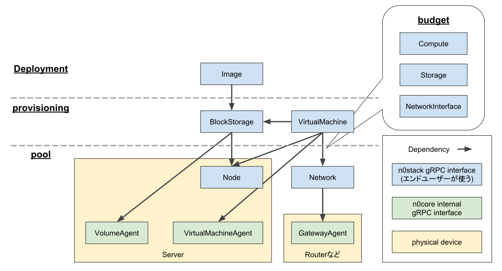

# n0proto

Protobuf definitions for all of n0stack services.

## Resource groups



### [Budget](budget/)

Budget define data structure about resource budget: CPU, Memory, IP address, MAC address, storage, and so on.

### [Pool](pool/)

Pool ensure Budgets.

### [Provisioning](provisioning/)

Provisioning create virtual resources on ensured budget.

### [Deployment](deployment/)

Deployment abstract Provisioning operations.

### [Configuration](configuration/)

Configuration setting up Provisioning.

## How to build

- Required Docker
- Generating Golang and Python files on n0proto.go and n0proto.py

```
cd ..
make build-n0proto-on-docker
```

## Principles

- Do not define variables that change with implementation, such values ​​should be placed in "annotations".
    - e.g. VLAN ID and VXLAN ID

### Standard fields

- Metadata (1 ~ 9)
- Spec (10 ~ 49)
- Status (50 ~)

```pb
  // Make unique!!
  string name = 1;
  // string namespace = 2;

  map<string, string> annotations = 3;
  // map<string, string> labels = 4;
```
